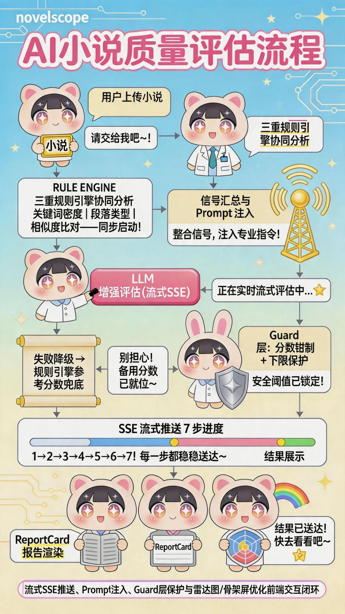

# NovelScope — 小说望远镜

AI 驱动的中文网文写作质量评估平台。定位为"编辑之眼"——告诉作者**哪里有问题、为什么、怎么改**，而非 AI 自动生成工具。




## 功能

- **追读力分析** — Hook 强度、爽点密度、章末悬念、节奏评分，四维雷达图
- **节奏曲线** — 可视化全章张力变化（纯 SVG，极值点保留，悬停详情）
- **注水检测** — bigram Jaccard 段落相似度分析
- **一致性检查** — 逻辑矛盾、角色声音一致性检测
- **改进建议** — 亮点优先，按严重度（严重/中等/轻微）分级，含修改方向
- **Token 成本** — 精确到千分位，实时展示每次评估的 API 调用成本

## 技术栈

| 层级 | 选型 |
|------|------|
| 前端 | Next.js + TypeScript + Tailwind CSS |
| 后端 | Next.js API Routes（单服务架构） |
| 数据库 | PostgreSQL + Prisma ORM |
| 向量数据库 | pgvector（P1） |
| 缓存 | Redis（P2） |
| LLM | DeepSeek-v4-flash（主）+ 豆包 API（辅，P1） |
| 嵌入模型 | bge-small-zh（P1.4） |
| 部署 | Vercel（P2） |
| 支付 | PayJS — 微信支付 + 支付宝（P1.6） |
| 测试 | Jest（后端）+ Vitest（前端） |

## 架构

```
POST /api/evaluate/stream (SSE 流式响应)
├── 规则引擎 v2 特征提取（本地，毫秒级）
│   ├── Hook 检测 — 开头类型分类 + 冲突/悬念密度 + 金句检测
│   ├── Climax 检测 — 5 类 50+ 爽点关键词分类命中
│   ├── Cliffhanger 检测 — 章末悬念类型 + 反转暗示
│   ├── Pacing 检测 — 段落分类 + 张力曲线 + CV/熵
│   └── Filler 检测 — bigram Jaccard 段落相似度
├── Prompt v2 构建（6 锚点 + 特征注入 + 软化分布引导）
├── 双模型编排（DeepSeek + 豆包，45s 超时，并行 Promise.allSettled）
│   ├── 双双成功 → 双模型分数合并 + 分歧检测（>2 分标记）
│   │   └── 分歧时 → console.warn 日志 + 前端双色雷达图对比
│   ├── 一成一败 (partial) → 使用成功方分数 + 标记失败模型
│   └── 双双失败 (degraded) → degrade-report 模板 NLG 定性报告
├── Guard — clamp 校验 + 方差检测 + 双模型分歧检测
└── 持久化（P1.2）+ 配额检查（P1.6）
```

## 快速开始

### 1. 获取 API Key

前往 [DeepSeek 开放平台](https://platform.deepseek.com/api_keys) 注册并创建 API Key。

### 2. 安装依赖

```bash
npm install
```

### 3. 配置环境变量

```bash
cp .env.example .env
```

编辑 `.env` 文件，填入以下内容：

```env
# 必填：DeepSeek API Key（从 platform.deepseek.com 获取）
DEEPSEEK_API_KEY=sk-your-deepseek-api-key

# 必填：PostgreSQL 数据库连接
DATABASE_URL=postgresql://localhost:5432/novelscope

# 可选：豆包 API Key（P1 双模型对比，未配置时仅用 DeepSeek）
# DOUBAO_API_KEY=your-doubao-api-key
```

### 4. 数据库迁移

```bash
cd backend && npx prisma generate && npx prisma db push
```

### 5. 启动

```bash
# 在 backend 目录下同时启动前后端（前端 :3000，后端 :3001）
npm run dev
```

## 项目结构

```
├── frontend/              # Next.js 前端 (port 3000)
│   └── src/
│       ├── app/           # 页面路由 ((auth)/*, (dashboard)/*, share/*)
│       ├── components/    # UI 组件（ProgressBar / ReportCard / RadarChart）
│       ├── lib/           # 工具函数、认证上下文
│       └── types/         # 类型定义
├── backend/               # Next.js API 服务 (port 3001)
│   └── src/
│       ├── app/api/       # API 路由（evaluate / auth / novels / history / memory / payment）
│       ├── lib/           # Prisma 客户端、认证守卫、env 校验
│       ├── services/      # 业务逻辑
│       │   ├── climax/    # 爽点密度规则引擎
│       │   ├── pacing/    # 节奏分析规则引擎
│       │   ├── filler/    # 注水检测规则引擎
│       │   ├── hook/      # Hook 检测规则引擎
│       │   ├── cliffhanger/  # Cliffhanger 检测规则引擎
│       │   ├── llm/       # LLM Client（DeepSeek + 豆包）
│       │   ├── prompt/    # Prompt 模板（锚点 + 信号注入）
│       │   ├── guard/     # 分数钳制 + 方差校验 + 双模型分歧检测
│       │   ├── pipeline/  # 双模型编排（并行 + 截断循环 + 降级路径）
│       │   ├── degrade-report/  # 降级报告模板 NLG
│       │   ├── memory/    # 向量记忆（实体提取 + pgvector）
│       │   ├── style/     # 文风分析规则引擎（P1.5）
│       │   ├── ai-detect/ # AI 痕迹检测（P1.5）
│       │   ├── trend/     # 题材热度（P1.5）
│       │   ├── storage/   # 持久化服务（P1.2）
│       │   ├── payment/   # 支付 + 配额（P1.6）
│       │   └── golden-sample/  # Golden Sample 验证
│       └── scripts/       # CLI 工具（calibrate.ts 等）
├── docs/                  # 文档
│   ├── prd/               #   技术 PRD
│   ├── design/            #   设计系统 + MVP 设计文档
│   ├── reports/           #   审查报告 + 市场调研 + Golden Sample
│   ├── product/           #   产品立项定义
│   ├── assets/            #   图片 + 截图
│   └── issues/            #   Issue 追踪 (P0/ + P1/)
└── CLAUDE.md              # 项目开发指南
```

## 开发进度

**当前阶段**: P1.1 规则引擎 v2 重构中 — 规则引擎转型特征提取器 + Prompt v2 锚点评分 + 双模型编排已完成。

### P0（已完成 ✅）

17 个 Issue，全部交付。

### P1（进行中 ⏳）

25 个 Issue（已完成 8 个：p1-001~008），254 个后端测试通过（Jest）。

| 阶段 | 内容 | 状态 |
|------|------|------|
| P1.0 | API key 轮换 + CORS 中间件 + CI 搭建 | ✅ 完成（p1-001, p1-002） |
| P1.1 | 规则引擎 v2 重构（特征提取器 + Prompt v2 锚点 + 双模型编排 + Guard 分歧检测 + Degrade-Report） | ✅ 6/8（p1-003~008），p1-009 性能优化 + p1-010 前端适配 待开始 |
| P1.2 | 用户注册/登录/GitHub OAuth + 认证 UI | ⏳ 待开始（p1-011~013） |
| P1.3 | 评估结果入库 + 历史仪表盘 + 报告分享 | ⏳ 待开始（p1-014~017） |
| P1.4 | pgvector 向量记忆（角色/设定提取 + 跨章节一致性） | ⏳ 待开始（p1-018~021） |
| P1.5 | 文风分析 + AI 痕迹检测 + 题材热度 | ⏳ 待开始（p1-022~024） |
| P1.6 | 微信/支付宝支付 + 三级会员（免费/标准/专业） | ⏳ 待开始（p1-025~026） |

详见 [Issue 追踪表](docs/issues/README.md) 和 [P1.1 PRD](docs/prd/PRD-P1-规则引擎v2重构.md)。

## 评分模型

P1.1 四维评分（规则引擎 v2 特征提取器 + Prompt v2 6 锚点评分 + 双模型交叉验证）：

| 维度 | 数据来源 |
|------|----------|
| Hook | 规则引擎（开头类型 + 冲突/悬念密度 + 金句）+ DeepSeek + 豆包 |
| Climax | 规则引擎（5 类关键词分类命中 + 对话/冲突密度）+ DeepSeek + 豆包 |
| Cliffhanger | 规则引擎（结尾类型 + 反转暗示 + 悬念密度）+ DeepSeek + 豆包 |
| Pacing | 规则引擎（段落分类 + 张力曲线 + CV/比例）+ DeepSeek + 豆包 |

双模型分歧 > 2 分时标记为"需人工判断"，双模型同时不可用时降级为 degrade-report 模板 NLG 定性报告。详见 [PRD](docs/prd/PRD-P1-规则引擎v2重构.md)。

## 文档

| 文档 | 说明 |
|------|------|
| [CLAUDE.md](CLAUDE.md) | 项目开发指南（技术栈、模块、开发模式、Skill 路由） |
| [DESIGN.md](docs/design/DESIGN.md) | 设计系统（字体、颜色、间距、组件规范） |
| [AI小说创作平台-产品立项定义文档.md](docs/product/AI小说创作平台-产品立项定义文档.md) | 产品立项定义 |
| [AI小说创作市场调研报告-三方验证版.md](docs/reports/AI小说创作市场调研报告-三方验证版.md) | 市场调研报告 |
| [PRD-P0-追读力评估原型.md](docs/prd/PRD-P0-追读力评估原型.md) | P0 技术 PRD |
| [PRD-P1-规则引擎v2重构.md](docs/prd/PRD-P1-规则引擎v2重构.md) | P1 规则引擎 v2 重构 PRD（特征提取器 + 锚点评分 + 双模型） |
| [docs/issues/README.md](docs/issues/README.md) | Issue 追踪表（P0 完成 + P1 规划） |

## License

Private — 所有权利保留。
